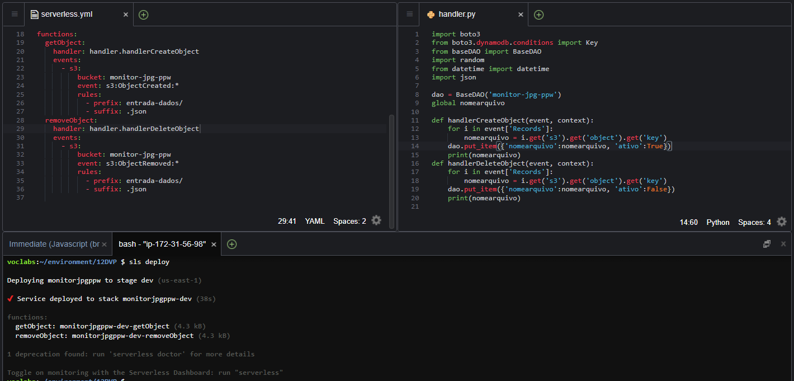
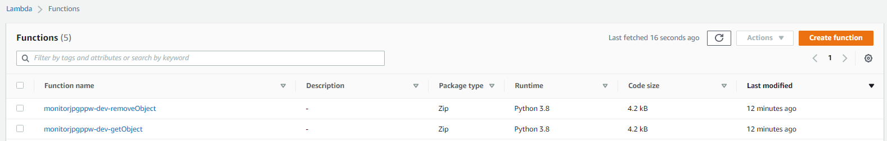
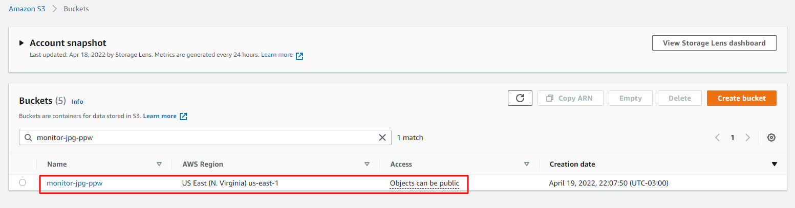
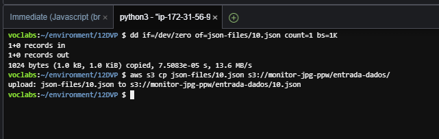
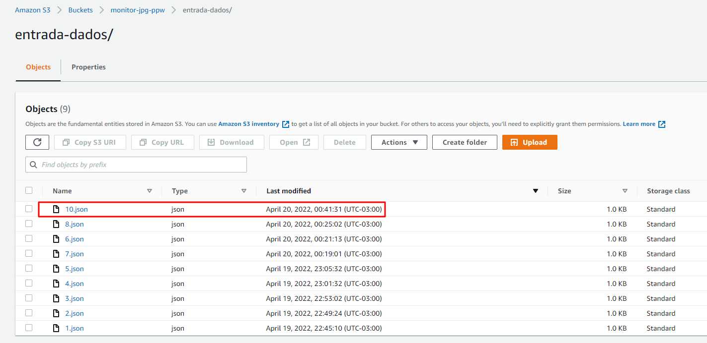
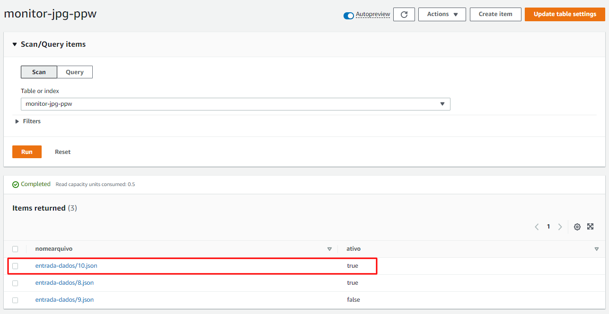
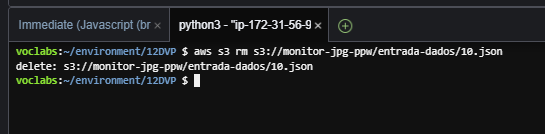
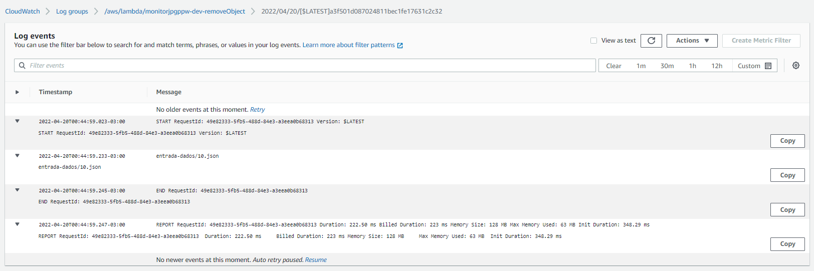
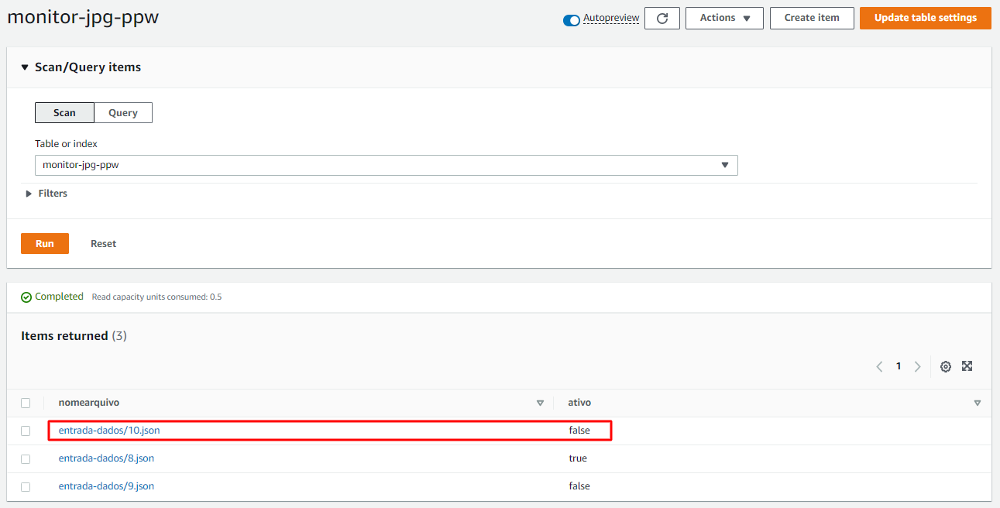

# Desafio Final Cloud Computing - Turma 12DVP

### Integrantes:

- PEDRO CARDENETE VICENTE – RM 343560
- PAULO HENRIQUE NUNES VANDERLEY – RM 343889
- WAGNER EDUARDO PEREIRA – RM 342643


[Link GitHub](https://github.com/PedroCardenete/cloud-computing-12DVP)

## (Opcional) Instalar ambiente local para execução do Serverless Framework. 

Para preparar o ambiente local, executar o script abaixo. 

```
./install-local/install.sh
```

## Imagens da aplicação em funcionamento.

### 1. Realizado o deploy da Lambda e S3 na AWS via Serverless Framework. Nota: DynamoDB criado manualmente via Console. 







### 2. Criação de arquivo json e upload para o S3.  



### 3. Upload com sucesso no S3. 



### 4. Log do CloudWatch registrando a trigger no Lambda monitorjpgppw-dev-getObject.


### 5. Registro do json no DynamoDB como ativo igual a True (criado). 



### 6. Deleção do arquivo json no S3. 



### 7. Log do CloudWatch registrando a trigger no Lambda monitorjpgppw-dev-removeObject.



### 8. Registro do json no DynamoDB como ativo igual a False (deletado). 


